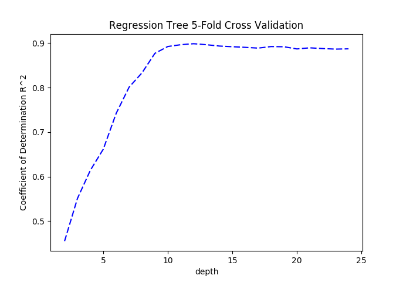

# 1. Introduction

We want to use historical usage patterns and weather data to forecast bike rental demand in the Capital Bikeshare program
in Washington, D.C. Using these results, we would be able to better optimize this service during times of high demand
and improve the overall experience of renting a bike.

# 2. Methodologies

## 2.1 Data Pre-Processing

One key point to note is that when creating our training and testing datasets from the given bike training data,
it is important to shuffle this data before splitting.
The training data is organized by time and issues may arise if a model is trained with more data from a specific time period and
tested on a time period that the model has seen less of (eg. training with January and testing on December).

It may also be beneficial to transform our data into forms that may be more beneficial to training our models.
Approaches that may be useful would be removing abnormal data points that may confuse our models,
normalizing all of our features to prevent single features from dominating the model,
removing features that are uninformative,
and transforming rental counts into log(count+1).

(additional, more in depth comments on data processing can be found in the source code)

## 2.2 Model Selection

We will train a variety of classical and state-of-the-art machine learning models with our historical data to find the
model that best fits this problem. We will split our training data into a training set (75%) and a testing set (25%) so that we can
train with cross validation and test on a known test set that the model has not seen before.
Once we have determined the best model by looking at RMSE, we will train that model using the entire training set
and predict the rentals of the test set for which we do not know the true values of.

Key considerations when building out this model include the size of our dataset as well as the type of data we are given and predicting.
Because the data input includes both continuous and categotical data, it seems intuituve that trees will perform better than
linear models, this is something that we can test. Furthermore, regression type models would make sense for this problem as the
output is continuous and is not a classification problem.

# 3. Models

## 3.1 Linear Regression

We can begin by simply running a multiple linear regression over all of the features and examining the results.
Unsurprisingly, the results are quite poor, with a RMSE of 143.5 and an $R^2$ of 0.39.
Converting the rental count into the form log(count+1) gives us an even worse RMSE of 161.5.
It would probably be possible to improve our results of the multiple linear regression by examining strong features
that are better correlated with the number of bike rentals but it seems that a simple multiple linear regression overall
may not be the best model for this type of data as it contains both categorical and continuous features.

## 3.2 Tree Regression

First, we try to use a simple tree regression algorithm with all of the features and observe the results.
Immediately, we can see a vast improvement in the performance of the model.
We use k-fold cross validation in order to fully utilize our entire training data set.
When using the entire training set to train the model with cross validation, we find that the optimal depth of the tree is 11
and checking performance using the same training data gives us a RMSE of 36.77 and an $R^2$ of 0.96.
Obviously bias is introduced when training and testing on the same dataset.
We can instead take out 25% of the training set to use as a test set the model has never seen before and train on the rest.
From that we find a RMSE of 55.25 and an $R^2$ of 0.91.
Results that are still significantly better than the simple multiple linear regression.
Additionally, we again find that the rental count transformation to log has no positive effect,
making our RMSE increase to 65.48 when tested on unseen data.

{width=50%}

Building on top of this, we can further clean the given data by normalizing the continuous values and removing some features that
may be uninformative. In this case, we normalized the continuous features (temp, atemp, humidity, windspeed) in order to reduce the
impact of large values and abnormal values. We can immediately see that running a tree regression over this cleaned data will
produce a much better result.

{width=50%}

We found that with the normalized data, we acheived a RMSE of 0.95 (this number varies based on how the tree is created but is generally around 1) and an $R^2$ of 0.99.

## 3.3 AdaBoost Regressor

Building on top of our more successful results using a tree regression, we also train an AdaBoost regression model to
predict bike rentals. Moving forward, we will no longer train our models on both the raw data and our cleaned data.
It is been sufficiently shown that the models trained on cleaned data significantly outperforms models trained on
raw unaltered data. We find that the optimal parameters for an AdaBoost regression are 400 n-estimators, a 0.96 learning rate,
and a square loss function.
This produces a RMSE of 7.47 and an $R^2$ of .998.
Surprisingly, this model, trained with the cleaned training data, does not outperform our simple tree regression.

## 3.4 Random Forest Regressor

Seeing as how our single tree regression produces the best results so far, naturally we would be inclined to think that
a random forest might be able to product even better results. This is in fact the case. When training our model with cross validation,
we found that the optimal parameters were
10-25 number of trees in the forest,
max features as the total number of features put in,
and a maximum depth of around 10-20.
The optimal parameters seem to be highly dependent on how the trees are created.
However, our test results remain very similar.
We have acheived a RMSE of 0.48 and an $R^2$ of 0.9999.
Intuitively, this result makes sense because the results of our single tree regression were already
quite strong and by combining multiple trees we can bolster these results.

# Summary of Results

| Model    | Data Clean | MSE      | RMSE  | $R^2$ |
|----------|------------|----------|-------|-------|
| Linear   | No         | 20592.25 | 143.5 | 0.39  |
| Tree     | No         | 3052.56  | 55.25 | 0.91  |
| Tree     | Yes        | 0.9025   | 0.95  | 0.99  |
| Adaboost | Yes        | 55.73    | 7.47  | 0.998 |
| Forest   | Yes        | 0.231    | 0.48  | 0.999 |

From these results we observe that the random forest regression was able to significantly outperform the other
models that we trained. Thus, for our predictions on the test dataset we will be using the entire training 
dataset to train a random forest regression and then take the optimal parameters to predict the output of
the test dataset.

Using all of the training data, we get the optimal parameters:
$$\text{n-estimators: 5}$$
$$\text{max features: auto}$$
$$\text{max depth: 23}$$
